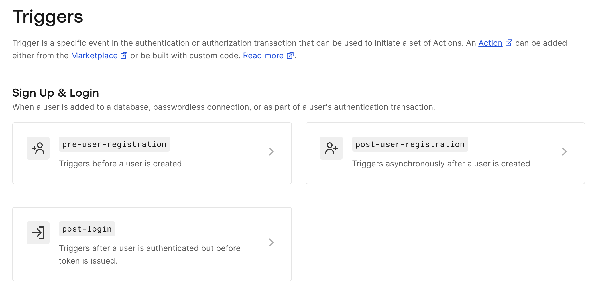
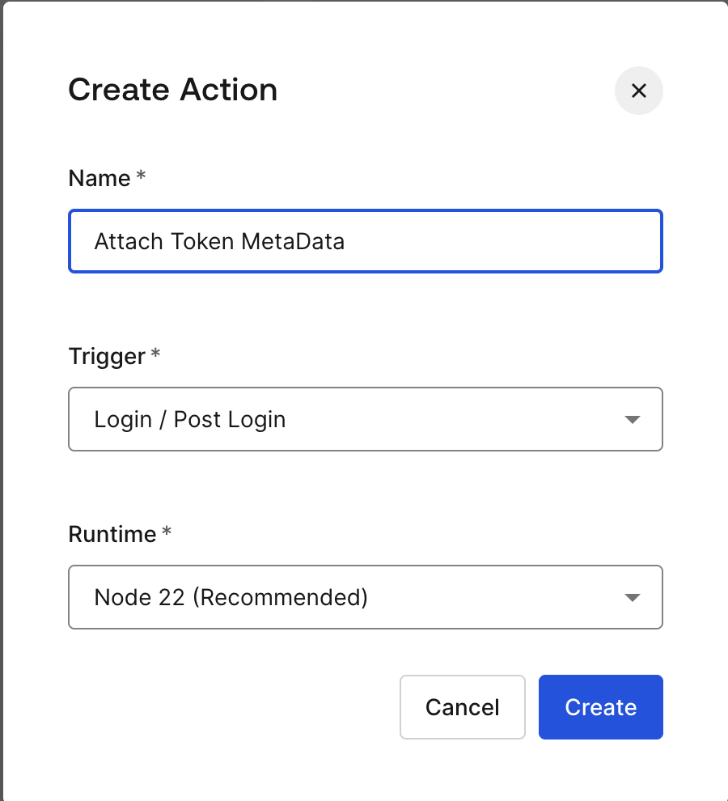
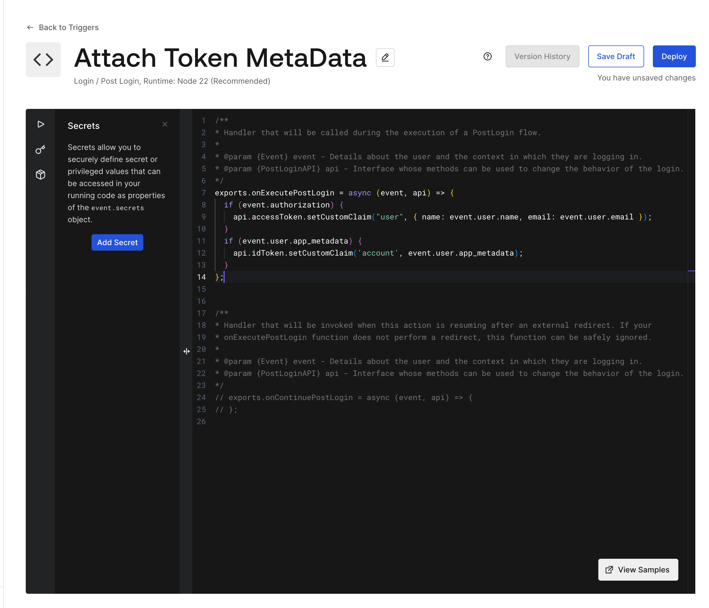
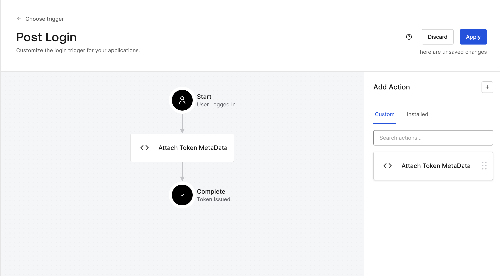
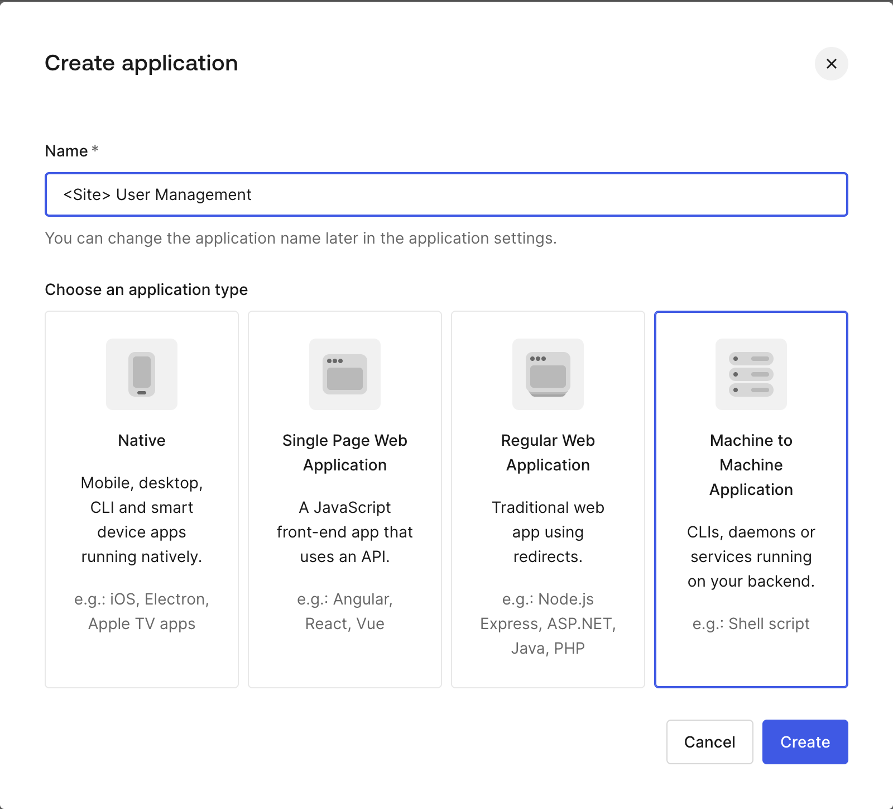
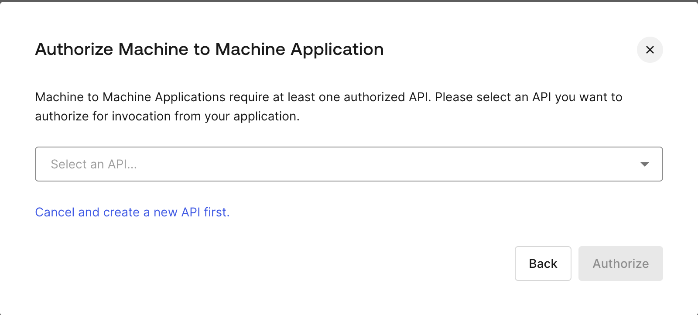
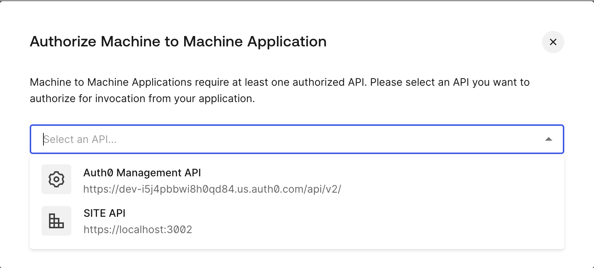
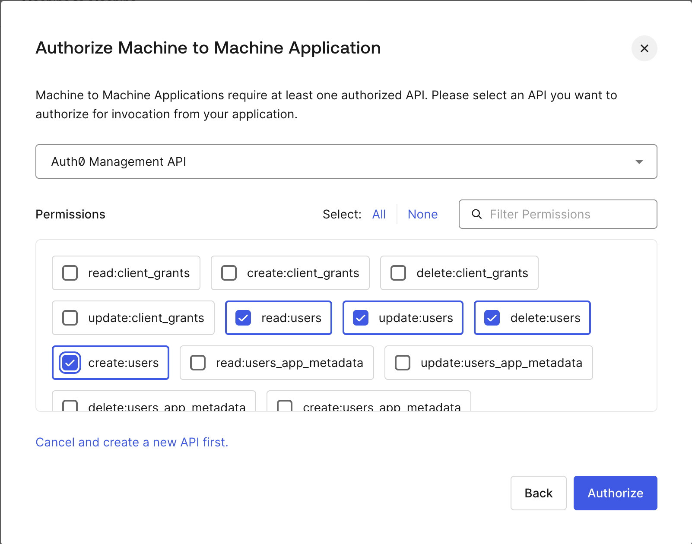

# pinoy-printing

## Structure and Technologies

### FrontEnd
- Tech Stack:
  - Vite
  - React
  - Redux
  - Redux Toolkit
- Environment Variables: (defined in .env file in root directory)
  - VITE_BACKEND_PORT: The port the backend server is running on for local development
  - VITE_FRONTEND_PORT: The port the frontend server will run on for local development
  
  - VITE_AUTH0_DOMAIN: The Auth0 Domain
  - VITE_AUTH0_CLIENT_ID: The Auth0 Client ID
  - VITE_AUTH0_AUDIENCE: The Auth0 API Identifier
  
  - VITE_APP_TITLE: The title of the application

### BackEnd
- Tech Stack:
    - Node.js / Express
    - MongoDB / Mongoose
    - Redis
    - Auth0
- Environment Variables: (defined in .env file in root directory)
  - PORT: The port the backend server will run on for local development

  - AUTH0_AUDIENCE: The Auth0 API Identifier
  - AUTH0_ISSUER_DOMAIN: Defined as the Auth0 Issuer Domain
  - AUTH0_TOKEN_SIGNING_ALG: Defined as the Auth0 Token Signing Algorithm
  - AUTH0_MANAGEMENT_CLIENT_ID: The Auth0 Management App Client ID
  - AUTH0_MANAGEMENT_CLIENT_SECRET: The Auth0 Management App Client Secret

  - AUTH0_ADMIN_ROLE_ID: The Auth0 Admin Role ID
  - AUTH0_CUSTOMER_ROLE_ID: The Auth0 Customer Role ID
  - AUTH0_OWNER_ROLE_ID: The Auth0 Owner Role ID
  - AUTH0_STAFF_ROLE_ID: The Auth0 Staff Role ID

  - MONGO_URI: MongoDB connection string
  - MONGO_DB: MongoDB database name
  
  - REDIS_URI: Redis connection string
  - REDIS_LOGGING: Redis logging flag

### Auth0
#### 1. Create Application
  - Setup Application URIs
    - Allowed Callback Urls
    - Allowed Logout Urls
    - Allowed Web Origins
#### 2. Create API
  - Setup Permissions
    - create:users : Allows Creation of Users
  - Enable RBAC
  - Add Permissions in the Access Token
#### 3. Roles
  - Create
    - admin
    - customer
    - owner
    - staff
  - Assign Permissions to Roles

#### 4. Update Actions ( Auth0 Dashboard )
1. On the Triggers page, select Post Login



2. Click the Plus icon to add a new Action


3. Choose the "Create Custom Action" option


4. Name it "Attach Token MetaData"



5. Update the **exports.onExecutePostLogin** function to include the following code:
   ```javascript
         exports.onExecutePostLogin = async (event, api) => {
           if (event.authorization) {
             api.accessToken.setCustomClaim("user", { name: event.user.name, email: event.user.email });
           }
           if (event.user.app_metadata) {
              api.idToken.setCustomClaim('account', event.user.app_metadata);
           }
         };
   ```



6. Click "Deploy"
7. Then Click "Back to Triggers"
8. Drag the "Attach Token MetaData" action between the "Start" and "Complete" Actions



9. Click "Apply"
 
#### 5. Create User Management Application (Auth0 Dashboard)
1. Name it "<Site> User Management" (where <Site> is the name of your site)
2. Select "Machine to Machine Application" as the Application Type
    
3. Click "Create"
4. On the next screen, select the **Auth0 Management API** from the dropdown menu
   
   
5. Click "Authorize"
6. On the next screen, select the **read:users**, **create:users**, **update:users**, and **delete:users** permissions
    
7. Click "Authorize"
